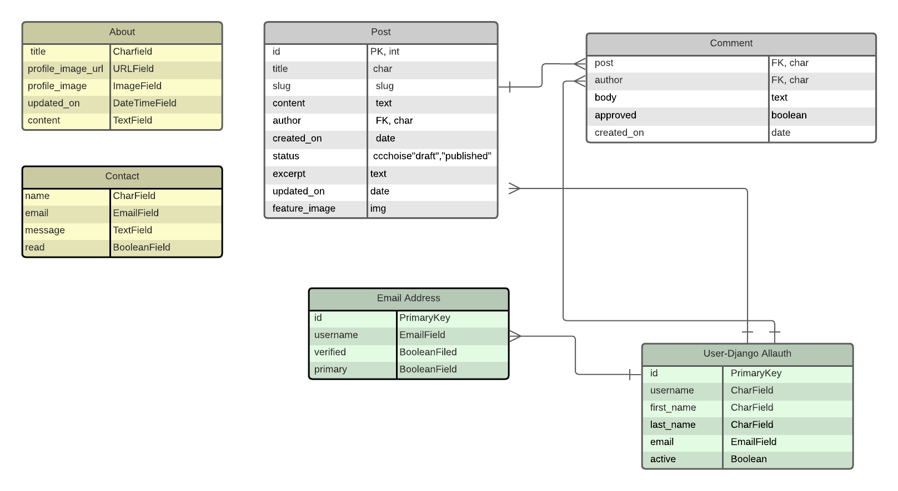
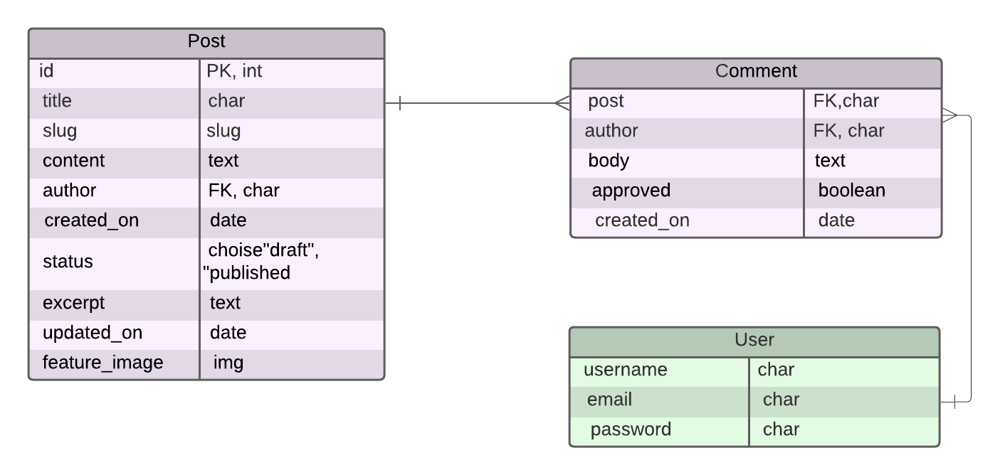

# PP4 UkMove

## Developer: Istem Karakas

[View the live project here](https://ukmove-45adf8d4e460.herokuapp.com/)

[View GitHub repository](https://github.com/techistem/UkMove_CI_P4)

## Introduction

UkMove is a website designed to support individuals starting a new life in the UK. Tailored for those who have
recently moved or are planning to relocate, the platform provides valuable information about living in the UK.

Visitors to the website can explore various topics, gaining insights and practical advice on settling into a new 
country. 

Registering and logging in grants users the ability to actively participate by sharing their experiences, leaving
comments, and interacting with others. Registered users can also manage their profiles, contribute posts, and engage 
in discussions, fostering a supportive and collaborative community.

UkMove is designed to create a welcoming environment where users can both seek and offer guidance, making the transition
to life in the UK smoother and more enjoyable.

## UX

### Planning Stage

#### Aim

The aim of UkMove is to support individuals transitioning to life in the UK by providing a reliable platform for exploring, 
sharing, and gaining insights about living in a new country. Through practical advice, user experiences, and a collaborative 
community, UkMove seeks to ease the challenges of relocation, foster connections, and empower users to confidently start their 
journey in the UK. Whether it’s discovering essential resources, learning from others’ experiences, or finding a supportive 
network, UkMove is designed to make settling into the UK smoother and more welcoming.

#### Application Goals

Goals for New Users
* As a new site user, I would like to navigate an intuitive and user-friendly website that is fully responsive across all devices.
* As a new site user, I would like to create an account so that I can share my experiences, comment on, and like posts shared by others.
* As a new site user, I would like to easily edit and delete any comments or posts that I create.
* As a new site user, I would like to clearly understand the main purpose of the website and how it can support me in transitioning 
to life in the UK.
* As a new user, I want visually appealing and relevant imagery with color schemes that enhance the content and create a welcoming 
environment.

Goals for Returning Users
* As a returning site user, I would like to easily navigate a user-friendly website that is fully responsive across all devices.
* As a returning site user, I would like to quickly log into my account so I can interact with the community, comment on,
and like posts shared by others.
* As a returning site user, I would like to easily edit or delete any comments or posts I have made.

Goals for Site Administrators
* As a site administrator, I want to have an easily identifiable and branded admin area where I can manage users, blog posts, comments.
* As a site administrator, I need a simple process to create blog posts, whether in draft form or published, for display on UkMove.
* As a site administrator, I want to be able to easily update the "About" section and profile picture through an intuitive UI.
* As a site administrator, I require the ability to approve user comments before they appear on the front-end of the site.
* As a site administrator, I want the site to have a clean and simple UI that encourages users to engage and return.
* As a site administrator, I want to be able to easily add new blog posts to the website from the front-end.
* As a site administrator, I need the ability to edit or delete blog posts directly from the website's front-end.

#### User Stories

All epics, user stories with their acceptance criteria and tasks can be viewed on the 
[Github Project Board](https://github.com/users/techistem/projects/18).

### Wireframes

### Wireframe Planning Process

For UkMove, the wireframe section focuses on planning the structure and layout of the website to ensure an optimal user
experience. The wireframes were designed to create a user-friendly, responsive platform where users can easily navigate 
and find the information they need.

1. ***Wireframes Created Using Balsamiq***
The wireframe planning process began with digital wireframes created using the desktop version of 
[Balsamiq](https://balsamiq.com/ "Link to Balsamiq homepage"). This tool allowed for clear visualization of the website’s 
layout and functionality, focusing on key pages such as the homepage, blog posts, user registration, and areas for user interaction.

2. ***Focus on User Experience***
The wireframes were designed with a strong focus on providing a positive user experience. This involved planning intuitive
navigation, ensuring users can easily access blog posts, create accounts, comment, and navigate between different sections 
of the site. A seamless user journey was prioritized, making it simple for users to find information about living in the UK 
and interact with the community.

3. ***Future Development***
Due to time constraints and unforeseen circumstances, certain pages, like the Destinations page, were postponed for 
future development. 

They can be found below:

### Flow Chart

A flowchart for UKMove was created using [Lucidchart](https://www.lucidchart.com/pages/ER-diagram-symbols-and-meaning) 
to visually represent the user interactions and website processes, ensuring a smooth and efficient user experience. 
This chart acts as a roadmap for the logical flow of actions on the site, helping to maintain consistency in its functionality.

 Below is the flowchart of the main process of this website:

  

 ### Color Scheme

 For UKMove, I selected colors inspired by the UK flag, focusing on creating a balanced and inviting visual theme. The color 
 palette incorporates dark blue, red, and white, providing a strong and recognizable connection to the UK while maintaining 
 a modern and professional appearance.

The darker tones of blue and red were chosen to give the site a sophisticated and calm atmosphere, aligning with the sense of 
stability and trust needed for users navigating big life changes like moving to a new country. White is used strategically for
 text and accents to ensure clarity and readability against the darker backgrounds.

I used [Coolors](https://coolors.co/) to experiment and refine the palette, ensuring the colors complement each other and provide sufficient contrast 
for accessibility. The chosen colors not only reflect the identity of the UK but also create an aesthetically pleasing and 
user-friendly experience.

Details of the full colour palette can be found below:

## Fonts

The fonts selected were from Google Fonts, Montserrat wits sans-serif as a backup font.

## Structure

### Wesites Pages

The UKMove website was designed with a user-friendly layout to ensure easy navigation. A consistent navigation bar
is located at the top of each page, providing quick access to key sections of the site. For smaller screens, 
a hamburger menu is included to maintain functionality and accessibility on mobile devices.

The footer contains all relevant links to UKMove’s social media platforms, allowing users to connect and engage further.
By following UKMove on social media, users can stay updated on the latest content, tips, and community discussions, 
helping to expand the platform's reach and foster a supportive network.

The site consists of the following pages:
   * The Home Page(the blog) of UKMove serves as the first point of contact for users and is designed to be welcoming, informative, and easy to navigate. Key elements of the page include: Hero Section, Navigation Bar, Introduction Text,
   Call-to-Action Buttons, Featured Blog Posts or Updates, User Testimonials or Tips, Footer

   * The About Page of UKMove provides an overview of the website's purpose and mission. It introduces the platform as a supportive space for individuals transitioning to life in the UK, offering practical tips, shared experiences, and a community to connect with.The page aims to build trust and create a welcoming impression for users exploring the site.Key elements include:
   
       - Mission Statement: A clear explanation of how UKMove helps newcomers adapt to their new environment.
       - Core Values: Emphasis on community, inclusivity, and helpfulness.
       - Team Information: A brief mention of the creators or contributors behind the site (if applicable).
       - Encouragement to Join: A friendly call-to-action inviting users to become part of the UKMove community by sharing their own experiences or connecting with others.

* The Contact Us page of UKMove allows registered users to send direct messages (DM) to the team. Additionally, users can contact UKMove via the displayed email address, phone number, or by visiting the listed physical address. This page ensures easy communication between users and the platform for any inquiries or support needs.
   
* The Login/Logout section of UKMove enables users to securely access their accounts. Registered users can log in by entering their credentials (username/email and password) to access personalized features such as commenting on posts, saving favourites, and managing their profile. Once logged in, users can easily log out to ensure their account remains secure. This section ensures that users have full control over their account access and helps maintain a personalized experience on the platform.

* The Blog Detail section of UKMove provides a detailed view of individual blog posts, allowing logged-in users to engage with the content through commenting functionality. This feature encourages active participation and interaction, creating a dynamic and user-driven environment. Only registered users can access the comment functionality, ensuring a more personalized and secure experience.

    - Comment on a Post: Registered users can leave comments on blog posts to share their thoughts, ask questions, or contribute additional information.
    - Edit or Delete Comments: Users have the ability to edit or delete their comments at any time, providing full control over their contributions.

* The My Profile section of UKMove allows registered users to view and manage their personal information

* The Blog Admin section of UKMove is designed for super administrators, granting them full control over managing blog posts. Super administrators can create new blog posts, view all existing posts, edit content as needed, and delete posts that are no longer relevant. This section ensures that the platform's content remains accurate, up-to-date, and aligned with the website's standards. Through the CRUD(Create, Read, Update, Delete) functionality, super administrators can efficiently manage the entire blog, ensuring a smooth experience for both content creators and users.

## Tools & Technologies Used

## Database Design

Entity Relationship Diagrams (ERD) are essential for visualizing the structure of a database before implementing models. They help to define the relationships between various tables, ensuring that the database is efficient and meets the needs of the project. By planning these relationships early, potential issues can be avoided, saving time during the development process.

For the UKMove project, a database schema was designed and mapped out before any coding began. Following best practices, the schema clearly outlines the relationships between the database tables to support the intended functionality of the platform.

To create the ERD, a free version of [Lucidchart](https://www.lucidchart.com/pages/ER-diagram-symbols-and-meaning) was utilized, providing a comprehensive and visually clear representation of the database structure.

Below is the database schema designed for the UKMove platform.

* Updated project ERD:
  
  

* Initial project ERD:

  